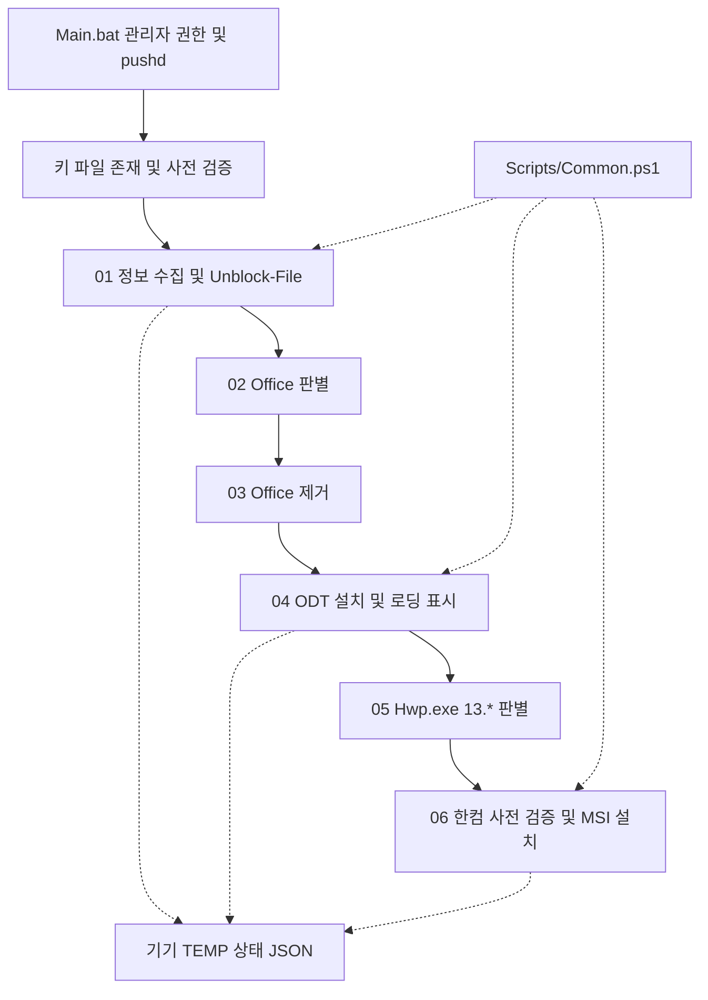

# 아키텍처 및 데이터 흐름

## Phase 2 현재 구조

모든 01~06 모듈은 Common.ps1을 dot-source합니다. Common 자신의 PSScriptRoot 부모를 DeployRoot로 계산하며 MyInvocation 경로 계산은 제거했습니다. 상태 경로는 호출부의 `%TEMP%\Tapbook_State.json` 계약을 유지하고 UTF-8로 읽고 씁니다. 기기별 단일 실행을 전제로 합니다.

키 검증은 Main 진입 및 01/03/04/06 직접 실행에 적용합니다. 누락·읽기 실패·공백·여러 줄·예제·명령행 특수문자는 거부하며 변경 작업 전에 코드 1로 종료합니다. 영숫자·하이픈 형식 제한은 인수 안전성을 위한 것으로 라이선스 유효성 검사가 아닙니다.

한컴은 키·매체·INI를 먼저 확인한 뒤 잔존 프로세스 종료 → 구버전 제거 → VC++ x86 → 내부 MSI 순으로 진행합니다. LevelOption=1은 공유 매체를 변경하지 않고 검증합니다. Office ODT /configure와 로딩 표시, Hwp.exe 13.* 판별, 한컴 /qn AGREETOLICENSE=yes PIDKEY 옵션은 유지합니다.

공통 로그는 기기 TEMP/duct-tape/Deployment.log에 기록합니다. MSI 상세 로그는 생성하지 않고 고정 메시지·종료 코드만 남깁니다. OS 정책·패키지 자체 로그 및 관리자 수준 프로세스 관찰로부터 키 은닉을 보장하지 않습니다. 상세 함수 계약은 [모듈 명세](wiki/Modules-Specification.md)를 참조하세요.

## Phase 3 구현 및 향후 Phase 4

클라이언트 ReportStatus → POST /api/report → FastAPI/SQLite → GET / 대시보드, 이후 백그라운드 HTTPS POST → GAS → Sheets로 확장합니다. MAC·오류코드·최종 보고 시각과 인증·중복 보고 계약은 [중앙 관제 가이드](wiki/Central-Monitoring.md)에 정의했습니다. 시트 역방향 동기화 필드·충돌 정책은 Phase 4 진입 전에 확정합니다.

관제에 키·설치 인수·원문 MSI 로그를 전달하지 않습니다. HTTP 매체는 로컬에 준비하며 HTTP URL을 DeployRoot로 사용하지 않습니다.

Phase 3: 01~06 → Common.Send-DeploymentEvent → ReportStatus.ps1 → FastAPI POST /api/report → SQLite 기기별 최신 행 → GET /api/devices → 대시보드입니다. 조회/보고 토큰은 분리하며 오류 보고에는 고정 오류 코드와 설치 종료 코드만 전달합니다. GAS 전송은 아직 미구현입니다.
