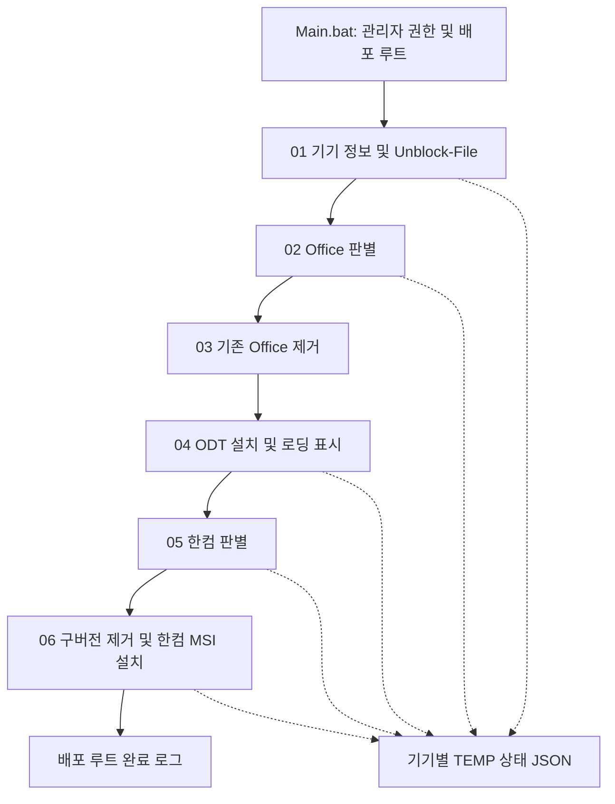
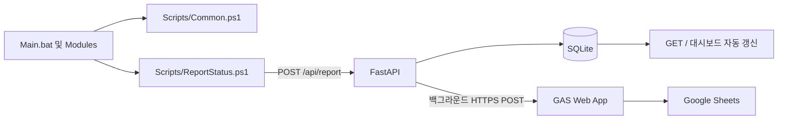

# 아키텍처 및 데이터 흐름

## 현재 구현

`Main.bat`은 관리자 권한을 확인하고 `pushd "%~dp0"`로 배포 루트에 진입합니다. 각 PowerShell 프로세스에 `-StateFile`로 `%TEMP%\Tapbook_State.json`을 전달합니다.

상태 필드는 `ComputerName`, `SerialNumber`, `Model`, `Manufacturer`, `OfficeState`, `HancomState`, `Timestamp`입니다. MAC·상세 진행률·오류코드·중앙 보고는 아직 없습니다. Timestamp는 정보 수집 시 기록되며 단계별 최종 보고 시각이 아닙니다.

대부분의 모듈은 `$PSScriptRoot`의 부모를 `$DeployRoot`로 사용합니다. 03 모듈의 재계산 및 백업 스크립트에는 `$MyInvocation`이 남아 있어 Phase 2에서 정리합니다.

## 보존 계약과 확인된 차이

| 영역 | 보존할 동작 | 현재 확인 및 후속 작업 |
| --- | --- | --- |
| Office | ODT `/configure install.xml`, 숨김 실행, 로딩 표시 | 구현됨. 종료 코드와 정품 인증은 구분 필요 |
| 한컴 | `Hwp130.msi`, `/qn AGREETOLICENSE=yes PIDKEY=...` | 구현됨. 0과 3010을 성공으로 처리 |
| 사전 처리 | Install/setup/msiexec 종료, 구버전 제거, VC++ x86 주입 | 구현됨. VC++ 파일이 없으면 현재는 건너뜀. 종료 코드 검증 보완 필요 |
| GUI 설정 | setup.ini의 `LevelOption=1` | 사용자 제공 현장 이력. 현재 코드에 자동 처리 없고 매체도 없어 실제 설정 확인 불가 |
| 보안 경고 | `Unblock-File` 유지 | 01에서 재귀 실행. 실패를 무시하므로 결과 확인 필요 |
| 키 보호 | 변경 작업 전 검증, 비밀값 비기록 | 현재 06은 구버전 제거 후 파일 존재만 검사. MSI 상세 로그 노출 여부 미검증 |

## 키 누락 시 안전 종료 설계 — Phase 2 구현 예정

1. Main.bat의 설치 흐름 진입 시 공통 사전 검증을 호출합니다. 어떤 제품의 제거·설치나 설치 프로세스 강제 종료보다 먼저 수행합니다. 06 단독 실행에서도 동일하게 검증합니다.
2. `$PSScriptRoot` 기반 배포 루트의 `Config/HancomKey.txt`를 확인합니다. 누락, 디렉터리, 읽기 실패를 거부합니다.
3. 앞뒤 공백을 제거한 후 빈 값·여러 줄·`REPLACE_WITH_YOUR_LICENSE_KEY`·기존 임시 값 `---`를 거부합니다. 실제 제품키 형식은 기관 매체 기준으로 확정하며 임의 정규식으로 유효성을 단정하지 않습니다.
4. 실패 시 `KEY_MISSING`, `KEY_UNREADABLE`, `KEY_INVALID` 같은 고정 오류 구분과 안내만 기록하고 종료 코드 1을 반환합니다. 배치는 즉시 중단하고 성공 로그를 남기지 않습니다.
5. 키나 파일 내용을 예외·상태 JSON·명령행 디버그 출력·보고 데이터에 넣지 않습니다. 실패 상태에도 비밀값을 기록하지 않습니다.
6. 검증한 키만 메모리에서 MSI 인수로 사용합니다. 필수 PIDKEY 전달은 유지하므로 권한 있는 프로세스 관찰자로부터 완전 은닉을 보장하지 않습니다. MSI 상세 로그의 속성 노출을 테스트하고 안전한 로깅 정책을 확정합니다.

검증 기준: 누락·공백·예제·읽기 실패 시 종료 코드 1, 설치/제거/강제 종료 호출 0회, 오류·상태·로그에 키 0건. 실제 설치 검증은 Windows 테스트 기기에서 수행합니다.

## 목표 구조 — 아직 미구현

- Phase 2: Common.ps1을 dot-sourcing하여 경로·인코딩·로깅·상태 I/O·키 검증을 공통화합니다. 설치 옵션과 안내를 유지하고 배치의 각 단계 종료 처리를 일관되게 합니다.
- Phase 3: Hostname/Serial/Model/MAC, 설치 상태, 오류코드 및 보고 시각을 저장합니다. 인증·기기 식별·중복 보고 계약을 확정합니다. 보고 실패는 설치를 중단하지 않습니다.
- Phase 4: GAS로 비밀정보를 제외한 자산·진척 정보를 전송합니다. 시트→서버 수정 가능 필드와 충돌 정책은 Phase 진입 전 확정합니다. 다이어그램은 구체화된 순방향만 표현합니다.

Wi-Fi는 전송 네트워크이고 SMB는 매체 접근 수단입니다. HTTP 사용 시 매체를 로컬로 준비해야 하며 URL을 DeployRoot로 사용하는 구조는 아닙니다. 관제에는 키·설치 명령행·원문 MSI 로그를 포함하지 않습니다.
